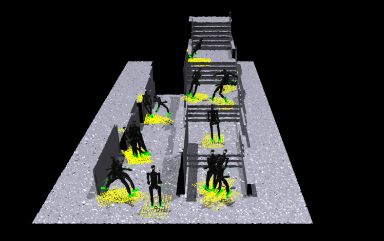
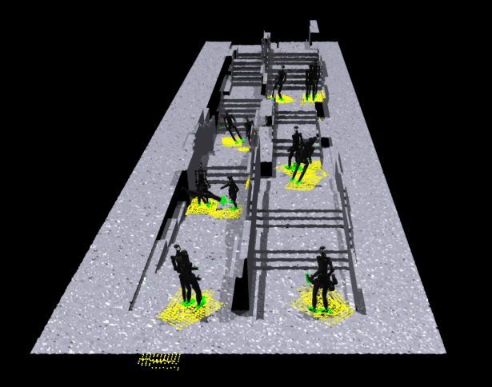
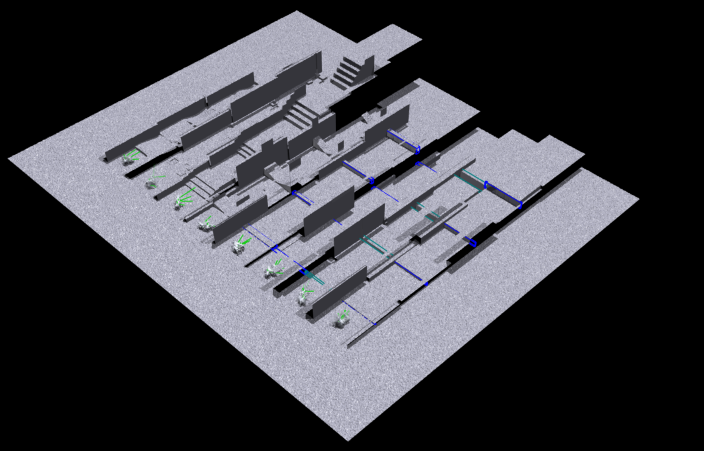

* BarrierTrack provides a policy for diverse terrains traverse.
* isgym默认不同env不会碰撞

# assign goal
* _update_command_by_terrain_goal belongs to legged_robot_fieldMixin;
* 直接h1_41_env继承FieldConfig会发生什么? Or, what does LRFieldMixin requires?
    1. requires BarrierTrack_terrain for training;
* What does it brings?


# track_size
```python
self.track_resolution = (
    np.ceil(self.track_kwargs["track_block_length"] * self.n_blocks_per_track / self.cfg.horizontal_scale).astype(int),
    np.ceil(self.track_kwargs["track_width"] / self.cfg.horizontal_scale).astype(int),
) # f
self.env_length = self.track_kwargs["track_block_length"] * self.n_blocks_per_track
```
* env_length 对应track_solution
* a track can be composed of multiple obstacle;
```
heightfield_noise = TerrainPerlin.generate_fractal_noise_2d(
    xSize= self.env_length,
    ySize= self.env_width,
    xSamples= self.track_resolution[0],
    ySamples= self.track_resolution[1],
    **TerrainPerlin_kwargs,
) / self.cfg.vertical_scale
```

# multiple block per track
* n_blocks_per_track=1



* n_blocks_per_track=3 && randomize_obstacle_order=True



# curriculum learning
* n_blocks_per_track in a env
* env is getting difficult with row_id increasing;
* env in different col_id but same row_id increases with 


* col_id能决定地形种类
```python
    def add_track_to_sim(self, track_origin_px, row_idx= None, col_idx= None):
        if self.track_kwargs.get("n_obstacles_per_track", None) == 1 and len(self.track_kwargs["options"]) > 0:
            obstacle_order = np.array([col_idx % len(self.track_kwargs["options"])])
```

* 什么是curriculum learing?
* randomization是随机化terrain的restitution,dynamic/static friction
* usage in legged_robot's reset_idx
```python
def reset_idx(self, env_ids):
    if self.cfg.terrain.curriculum:
        self._update_terrain_curriculum(env_ids)
    if self.cfg.commands.curriculum and (self.common_step_counter % self.max_episode_length==0):
        self.update_command_curriculum(env_ids)
```
* _update_terrain_curriculum
```python
def _update_terrain_curriculum(self, env_ids):
    if not self.init_done:
        # don't change on initial reset
        return
    move_up, move_down = self._get_terrain_curriculum_move(env_ids)
    self.terrain_levels[env_ids] += 1 * move_up - 1 * move_down
    # Robots that solve the last level are sent to a random one
    # terrain_levels大于max_terrain_level时，随机选择torch.randint_like
    # 否则取 torch.clip(self.terrain_levels[env_ids], 0)
    self.terrain_levels[env_ids] = torch.where(self.terrain_levels[env_ids]>=self.max_terrain_level,
                                               torch.randint_like(self.terrain_levels[env_ids], self.max_terrain_level),
                                               torch.clip(self.terrain_levels[env_ids], 0)) # (the minumum level is zero)
    self.env_origins[env_ids] = self.terrain_origins[self.terrain_levels[env_ids], self.terrain_types[env_ids]]
```
* terrain_level is decided distance to env_origins
```python
def _get_terrain_curriculum_move(self, env_ids):
    distance = torch.norm(self.root_states[env_ids, :2] - self.env_origins[env_ids, :2], dim=1)
    # robots that walked far enough progress to harder terains
    move_up = distance > self.terrain.env_length / 2
    # robots that walked less than half of their required distance go to simpler terrains
    move_down = (distance < torch.norm(self.commands[env_ids, :2], dim=1)*self.max_episode_length_s*0.5) * ~move_up
    return move_up, move_down
```
* 重设时，不会更新地形，只会更新机器人的位置，把他放到更难的或者更简单的地形中;
```python
self.root_states[env_ids] = self.base_init_state
self.root_states[env_ids, :3] += self.env_origins[env_ids]
```
* 为啥更后面的terrain_levels，难度更大
```python
# barrier_track.py
class BarrierTrack
    def add_track_to_sim(self):
        # define difficulty of obstacle
        difficulties = self.get_difficulty(row_idx, col_idx)
        ...
        for obstacle_idx, obstacle_selection in enumerate(obstacle_order):
            obstacle_name = self.track_kwargs["options"][obstacle_selection]
            obstacle_id = self.track_options_id_dict[obstacle_name]
            track_trimesh, track_heightfield, block_info, height_offset_px = getattr(self, "get_" + obstacle_name + "_track")(
                wall_thickness,
                starting_trimesh,
                starting_heightfield,
                difficulty= difficulty,
                heightfield_noise= heightfield_noise[
                    self.track_block_resolution[0] * (obstacle_idx + 1): self.track_block_resolution[0] * (obstacle_idx + 2)
                ] if "heightfield_noise" in locals() else None,
                virtual= virtual_track,
            )
            # maintain_height_field
            self.heightfield_raw[
                heightfield_x0: heightfield_x1,
                heightfield_y0: heightfield_y1,
            ] = track_heightfield + block_starting_height_px
            # add to sim
            self.add_trimesh_to_sim(
                track_trimesh,
                np.array([
                    heightfield_x0 * self.cfg.horizontal_scale,
                    heightfield_y0 * self.cfg.horizontal_scale,
                    block_starting_height_px * self.cfg.vertical_scale,
                ])
            )
```
* 不同行的难度的不一样，每个(列，行)由n_blocks_per_track个地形;
* 按obstacle_order再track的每一个block, 用get_xxx_track获取对应的地形;
* initialization of difficulty
```python
    def get_difficulty(self, env_row_idx, env_col_idx):
        difficulty = env_row_idx / (self.cfg.num_rows - 1) if self.cfg.curriculum else None
        virtual_terrain = self.track_kwargs["virtual_terrain"]
        return difficulty, virtual_terrain
```
* difficulty[env_row_idx]是个数
* role of difficulty
```python
    def get_jump_track(self, wall_thickness, trimesh_template, heightfield_template, difficulty= None, heightfield_noise= None, virtual= False,):
        if isinstance(self.track_kwargs["jump"]["height"], (tuple, list)):
            if difficulty is None:
                jump_height = np.random.uniform(*self.track_kwargs["jump"]["height"])
            else:
                jump_height = (1-difficulty) * self.track_kwargs["jump"]["height"][0] + difficulty * self.track_kwargs["jump"]["height"][1]
        else:
            jump_height = self.track_kwargs["jump"]["height"]

        height_value = jump_height / self.cfg.vertical_scale                
        track_heightfield[
            (0 if virtual else depth_px):,
            max(0, wall_thickness_px-1): min(-1, -wall_thickness_px+1),
        ] += height_value
```
* heightfield_noise是什么?
```python
# (192, 128)
heightfield_noise = TerrainPerlin.generate_fractal_noise_2d(
    xSize= self.env_length,
    ySize= self.env_width,
    xSamples= self.track_resolution[0],
    ySamples= self.track_resolution[1],
    **TerrainPerlin_kwargs,
) / self.cfg.vertical_scale
```
* (env_length=1.6, env_width=3.2), n_clocks_per_track=3
* heightfield_noise 对应第obstacle_idx个block的整体噪声；
* 用屁股想也能写出来，只是整体的全局变量和函数要熟悉

# env VS terrain
* terrain由(num_rows, num_cols)指定;
* num_envs由
* env is determined by env_origins
```python
def _create_envs(self):
    ...
    for i in range(self.num_envs):
        # create env instance
        env_handle = self.gym.create_env(self.sim, env_lower, env_upper, int(np.sqrt(self.num_envs)))
        pos = self.env_origins[i].clone()
        pos[:2] += torch_rand_float(-1., 1., (2,1), device=self.device).squeeze(1)
        start_pose.p = gymapi.Vec3(*pos)
```
* env_origins的初始化
```python
def _get_env_origins(self):
    """ Sets environment origins. On rough terrain the origins are defined by the terrain platforms.
        Otherwise create a grid.
    """
    if getattr(self.cfg.terrain, "selected", None) is not None:
        assert getattr(self.cfg.terrain, "mesh_type", None) is None, "Cannot have both terrain.selected and terrain.mesh_type"
        self.custom_origins = True
        self.env_origins = torch.zeros(self.num_envs, 3, device=self.device, requires_grad=False)
        # put robots at the origins defined by the terrain
        max_init_level = min(self.cfg.terrain.max_init_terrain_level, self.terrain.cfg.num_rows - 1)
        if not self.cfg.terrain.curriculum: max_init_level = self.cfg.terrain.num_rows - 1
        self.terrain_levels = torch.randint(0, max_init_level+1, (self.num_envs,), device=self.device)
        self.terrain_types = torch.div(torch.arange(self.num_envs, device=self.device), (self.num_envs/self.cfg.terrain.num_cols), rounding_mode='floor').to(torch.long)
        self.max_terrain_level = self.cfg.terrain.num_rows
        self.terrain_origins = torch.from_numpy(self.terrain.env_origins).to(self.device).to(torch.float)
        self.env_origins[:] = self.terrain_origins[self.terrain_levels, self.terrain_types]
    else:
        self.custom_origins = False
        self.env_origins = torch.zeros(self.num_envs, 3, device=self.device, requires_grad=False)
        # create a grid of robots
        num_cols = np.floor(np.sqrt(self.num_envs))
        num_rows = np.ceil(self.num_envs / num_cols)
        xx, yy = torch.meshgrid(torch.arange(num_rows), torch.arange(num_cols))
        spacing = getattr(self.cfg.env, "env_spacing", 3.)
        self.env_origins[:, 0] = spacing * xx.flatten()[:self.num_envs]
        self.env_origins[:, 1] = spacing * yy.flatten()[:self.num_envs]
        self.env_origins[:, 2] = 0.
```
1. cfg.terain.selected is not None, 未指定地形时好说
* 直接num_envs取平方根，得到行列数，再乘以env_spacing获取env_origins
2. 指定地形时，
* self.terrain.env_origins
```python
self.track_origins_px = np.zeros((self.cfg.num_rows, self.cfg.num_cols, 3), dtype= int)
for col_idx in range(self.cfg.num_cols):
    starting_height_px = 0
    for row_idx in range(self.cfg.num_rows):
        self.track_origins_px[row_idx, col_idx] = [
            int(row_idx * self.track_resolution[0]) + self.border,
            int(col_idx * self.track_resolution[1]) + self.border,
            starting_height_px,
        ]
for i in range(self.cfg.num_rows):
    for j in range(self.cfg.num_cols):
        self.env_origins[i, j, 0] = self.track_origins_px[i, j, 0] * self.cfg.horizontal_scale
        self.env_origins[i, j, 1] = self.track_origins_px[i, j, 1] * self.cfg.horizontal_scale
        self.env_origins[i, j, 2] = self.track_origins_px[i, j, 2] * self.cfg.vertical_scale
        self.env_origins[i, j, 1] += self.track_kwargs["track_width"] / 2
self.env_origins_pyt = torch.from_numpy(self.env_origins).to(self.device)
```

* num_cols和track的关系
* 由(num_rows, num_cols, n_blocks_per_track)个block, 每个env有n_blocks_per_track个block;
* env的length和width分别由track_block_length和track_width决定
```python
def initialize_track(self):
    self.track_resolution = (
        np.ceil(self.track_kwargs["track_block_length"] * self.n_blocks_per_track / self.cfg.horizontal_scale).astype(int),
        np.ceil(self.track_kwargs["track_width"] / self.cfg.horizontal_scale).astype(int),
    ) # f
```

* max_init_level是什么, initial position choices to assign in num_rows;
1. though (num_rows, num_cols, n_blocks_per_track) terrain is created, only max_init_level+1
of num_col tracks are used for training;

# Import terrain
* create plane: gym.add_ground
```python
    def create_sim(self):
        """ Creates simulation, terrain_lib and evironments
        """
        self.up_axis_idx = 2 # 2 for z, 1 for y -> adapt gravity accordingly
        self.sim = self.gym.create_sim(self.sim_device_id, self.graphics_device_id, self.physics_engine, self.sim_params)
        self._create_ground_plane()
        self._create_envs()

    def _create_ground_plane(self):
        """ Adds a ground plane to the simulation, sets friction and restitution based on the cfg.
        """
        plane_params = gymapi.PlaneParams()
        plane_params.normal = gymapi.Vec3(0.0, 0.0, 1.0)
        plane_params.static_friction = self.cfg.terrain.static_friction
        plane_params.dynamic_friction = self.cfg.terrain.dynamic_friction
        plane_params.restitution = self.cfg.terrain.restitution
        self.gym.add_ground(self.sim, plane_params)
        # make a difference here
```

* create terrain: gym.add_triangle_mesh
* terrain_class's role is to provides tri_meshes
* just imports it in arbitrary way

```python
    def create_sim(self):
        self.up_axis_idx = 2 # 2 for z, 1 for y -> adapt gravity accordingly

        self.sim = self.gym.create_sim(self.sim_device_id, self.graphics_device_id, self.physics_engine, self.sim_params)
        # self._create_ground_plane()
        self._create_stair()
        self._create_envs()

    # def _create_stair(self):
    #     StairTerrain = get_terrain_cls(self.cfg.terrain_lib.name)
    #     self.stair = StairTerrain(self.cfg.terrain_lib, self.num_envs)
    #     self.stair.add_terrain_to_sim(self.sim, self.gym)

    def _create_terrain(self):
        if getattr(self.cfg.terrain, "selected", None) is None:
            self._create_ground_plane()
        else:
            terrain_cls = self.cfg.terrain.selected
            self.terrain = get_terrain_cls(terrain_cls)(self.cfg.terrain, self.num_envs)
            self.terrain.add_terrain_to_sim(self.gym, self.sim, self.device)
            
    def add_terrain_to_sim(self, sim, gym):
        tm_params = gymapi.TriangleMeshParams()
        tm_params.nb_vertices = self.vertices.shape[0]
        tm_params.nb_triangles = self.triangles.shape[0]
        tm_params.transform.p.x = -1.
        tm_params.transform.p.y = -1.

        gym.add_triangle_mesh(sim, self.vertices.flatten(), self.triangles.flatten(), tm_params)  # 接着加mesh
```


# height_sensor
* self.terrain.height_terrain_raw
```python
    def __init__(self):
        if self.cfg.terrain.measure_heights:
            self.height_points = self._init_height_points()

    def _init_height_points(self):
        """ Returns points at which the height measurments are sampled (in base frame)

        Returns:
            [torch.Tensor]: Tensor of shape (num_envs, self.num_height_points, 3)
        """
        y = torch.tensor(self.cfg.terrain.measured_points_y, device=self.device, requires_grad=False)
        x = torch.tensor(self.cfg.terrain.measured_points_x, device=self.device, requires_grad=False)
        grid_x, grid_y = torch.meshgrid(x, y)

        self.num_height_points = grid_x.numel()
        points = torch.zeros(self.num_envs, self.num_height_points, 3, device=self.device, requires_grad=False)
        points[:, :, 0] = grid_x.flatten()
        points[:, :, 1] = grid_y.flatten()
        return points

    def _get_heights(self, env_ids=None):
        if self.cfg.terrain.mesh_type == 'plane':
            return torch.zeros(self.num_envs, self.num_height_points, device=self.device, requires_grad=False)
        elif self.cfg.terrain.mesh_type == 'none':
            raise NameError("Can't measure height with terrain_lib mesh type 'none'")

        # x'=T+Rx
        if env_ids:
            points = quat_apply_yaw(self.base_quat[env_ids].repeat(1, self.num_height_points), self.height_points[env_ids]) + (self.root_states[env_ids, :3]).unsqueeze(1)
        else:
            points = quat_apply_yaw(self.base_quat.repeat(1, self.num_height_points), self.height_points) + (self.root_states[:, :3]).unsqueeze(1)

        return self.terrain.get_terrain_heights(points)
```

* get_terrain_heights如何实现?
```python
    def get_terrain_heights(self, points):
        """ Return the z coordinate of the terrain_lib where just below the given points. """
        num_robots = points.shape[0]
        points += self.cfg.border_size
        points = (points/self.cfg.horizontal_scale).long()
        px = points[:, :, 0].view(-1)
        py = points[:, :, 1].view(-1)
        px = torch.clip(px, 0, self.heightsamples.shape[0]-2)
        py = torch.clip(py, 0, self.heightsamples.shape[1]-2)

        heights1 = self.heightsamples[px, py]
        heights2 = self.heightsamples[px+1, py]
        heights3 = self.heightsamples[px, py+1]
        heights = torch.min(heights1, heights2)
        heights = torch.min(heights, heights3)

        return heights.view(num_robots, -1) * self.cfg.vertical_scale
```
* 从采样点按水平位置选取， 自然要取整数

* terrain本来由trimesh-nparray生成
```python
class Terrain:
    def __init__(self, cfg: LeggedRobotCfg.terrain, num_robots) -> None:
        self.height_field_raw = np.zeros((self.tot_rows , self.tot_cols), dtype=np.int16)

    def add_terrain_to_map(self, terrain, row, col):
        self.height_field_raw[start_x: end_x, start_y:end_y] = terrain.height_field_raw

    def selected_terrain(self):
        for k in range(self.cfg.num_sub_terrains):
            # Env coordinates in the world
            (i, j) = np.unravel_index(k, (self.cfg.num_rows, self.cfg.num_cols))

            terrain = terrain_utils.SubTerrain("terrain_lib",
                              width=self.width_per_env_pixels,
                              length=self.width_per_env_pixels,
                              vertical_scale=self.vertical_scale,
                              horizontal_scale=self.horizontal_scale)
            eval(terrain_type)(terrain, **self.cfg.terrain_kwargs.terrain_kwargs)
            self.add_terrain_to_map(terrain, i, j)
```


# create terrain
可以直接从高度场构造, 修改height_field_raw, 通过convert_heightfield_to_trimesh转为ver,triangles
~~2. 也可以构造isgym.sub_terrain~~

* isgym： subterrain是个包含height_field_raw的类
```python
class SubTerrain:
    def __init__(self, terrain_name="terrain_lib", width=256, length=256, vertical_scale=1.0, horizontal_scale=1.0):
        self.terrain_name = terrain_name
        self.vertical_scale = vertical_scale
        self.horizontal_scale = horizontal_scale
        self.width = width
        self.length = length
        self.height_field_raw = np.zeros((self.width, self.length), dtype=np.int16)
```
* isgym通过各种地形构造函数，修改height_field_raw, 通过convert_heightfield_to_trimesh转为ver,triangles
* build terrain
```python
    self.heightsamples_float = self.generate_fractal_noise_2d(self.xSize, self.ySize, self.tot_rows, self.tot_cols, **cfg.TerrainPerlin_kwargs)
    self.heightsamples = (self.heightsamples_float * (1 / cfg.vertical_scale)).astype(np.int16)    

    @staticmethod
    def generate_perlin_noise_2d(shape, res):
        def f(t):
            return 6*t**5 - 15*t**4 + 10*t**3

        delta = (res[0] / shape[0], res[1] / shape[1])
        d = (shape[0] // res[0], shape[1] // res[1])
        grid = np.mgrid[0:res[0]:delta[0],0:res[1]:delta[1]].transpose(1, 2, 0) % 1
        # Gradients
        angles = 2*np.pi*np.random.rand(res[0]+1, res[1]+1)
        gradients = np.dstack((np.cos(angles), np.sin(angles)))
        g00 = gradients[0:-1,0:-1].repeat(d[0], 0).repeat(d[1], 1)
        g10 = gradients[1:,0:-1].repeat(d[0], 0).repeat(d[1], 1)
        g01 = gradients[0:-1,1:].repeat(d[0], 0).repeat(d[1], 1)
        g11 = gradients[1:,1:].repeat(d[0], 0).repeat(d[1], 1)
        # Ramps
        n00 = np.sum(grid * g00, 2)
        n10 = np.sum(np.dstack((grid[:,:,0]-1, grid[:,:,1])) * g10, 2)
        n01 = np.sum(np.dstack((grid[:,:,0], grid[:,:,1]-1)) * g01, 2)
        n11 = np.sum(np.dstack((grid[:,:,0]-1, grid[:,:,1]-1)) * g11, 2)
        # Interpolation
        t = f(grid)
        n0 = n00*(1-t[:,:,0]) + t[:,:,0]*n10
        n1 = n01*(1-t[:,:,0]) + t[:,:,0]*n11
        return np.sqrt(2)*((1-t[:,:,1])*n0 + t[:,:,1]*n1) * 0.5 + 0.5
```
